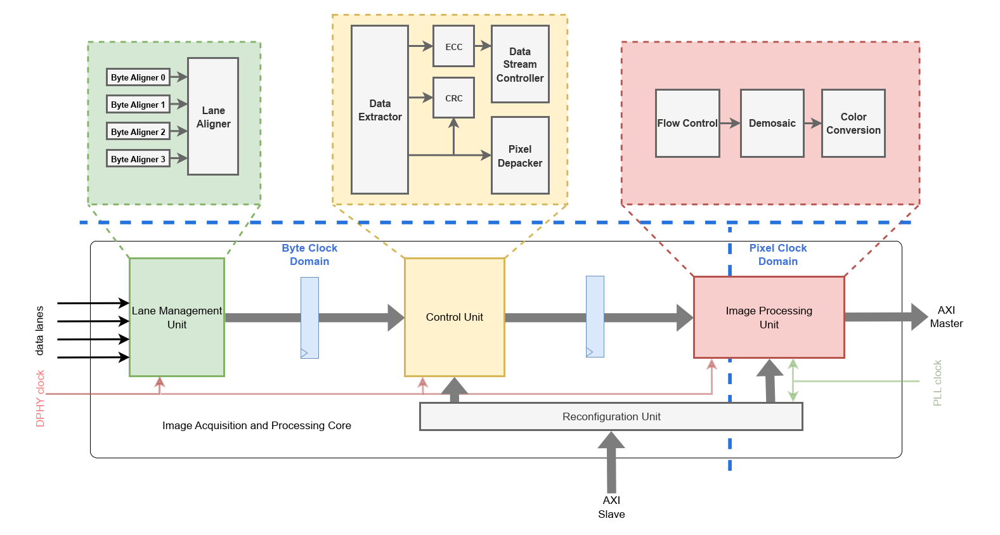

# ReImA

## Brief description

The repo features the following:</br>

* A reconfigurable image acquisistion and processing core which supports MIPI CSI-2 protocol.</br>
    The core supports the following configurations</br>
    - 1, 2, or 4 lane configuration
    - 1, 2, or 4 pixel per clock output
    - Supports YUV422_8, RGB888, RGB565, RAW8, RAW10 datatypes
* Programmability through AXI slave interface
* Simple AXI master with programmable destination address for the pixel stream

## Hardware Simulation
The following RTL simulation tools are supported with the versions specified:
- Questasim 10.7g

Initialise the project repo + submodules by using the command:

```
make repository_init
``` 

### Questasim

All build files can be deleted using the command:
```
make clean
```

Questasim is the primary tool used for verification. The following commands are used to compile the RTL:
```
make compile elaborate
```

Use the following commands to run the simulation in CLI
```
make run_test VLOG_DEFS=+define+PIC_TEST # runs simulation for an input picture
make run_test VLOG_DEFS=+define+REG_SANITY_TEST # runs simulation for register accesses
```

Use the following commands to run the simulation in GUI
```
make run_test_gui VLOG_DEFS=+define+PIC_TEST # runs simulation for an input picture
make run_test_gui VLOG_DEFS=+define+REG_SANITY_TEST # runs simulation for register accesses
```

## FPGA Emulation

🚧 **Under Construction** 🚧


## Development and Merge Operations

Project development should be done via feature branches. Merge branches to main often. For fluent merge housekeeping do following. From settings -> Merge requests:

* Enable "delete source branch" option by default: Yes (checkmark the box)

* Squash commits when merging: Encourage or Require. This will clean up main branch history by huge amount.

* Merge checks: Pipelines must succeed: Yes

* Merge checks: Skipped pipelines are considered successfull: No

* Merge checks: All threads must be resolved: Yes

Merges should be **always** reviewed and accepted by another developer.

## Documentation

All documentation will be hosted on pages: https://soc-hub.gitlab-pages.tuni.fi/ss-template

After setting up repo to run CI, replace **ss-template** with your repo path, generally follows pattern: chip/type/module. Alternatively you can find it from: deploy-> pages.

Additionally, check settings -> general: pages is enabled with option "Only Project Members"

## Repository pipeline settings

To ensure issueless operation for CI, ensure that settings -> CI/CD has following settings:

### General pipelines

* Auto-cancel redundant pipelines: Yes 

* Git strategy: git clone

* Git shallow clone: 1

### Runners 

* Available group runner: tie-sochub-gitlabrunner-ci (if missing contact matti.kayra@tuni.fi and/or arto.oinonen@tuni.fi) 

### Token Access

* Limit access: No (it would prevent hiearchical repository access in CI)


## Additional important repo notes

Insert source / authors / licences / acknowledgements as deemed needed
